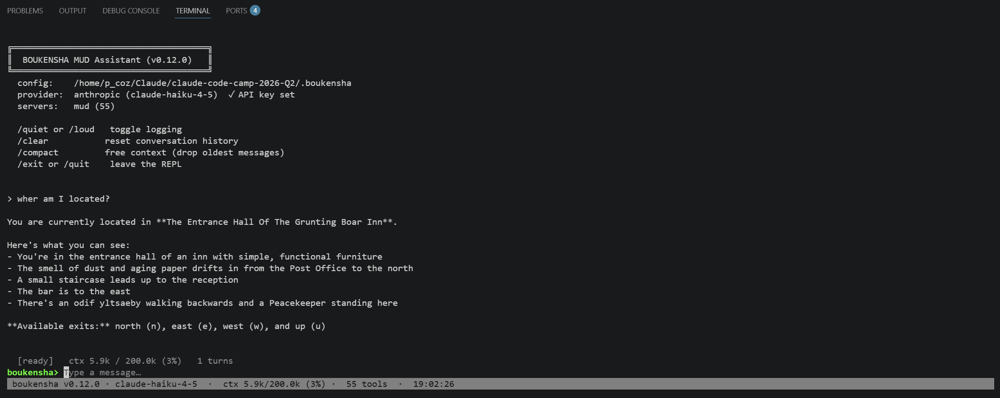
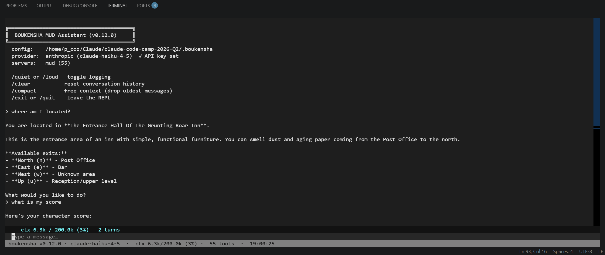
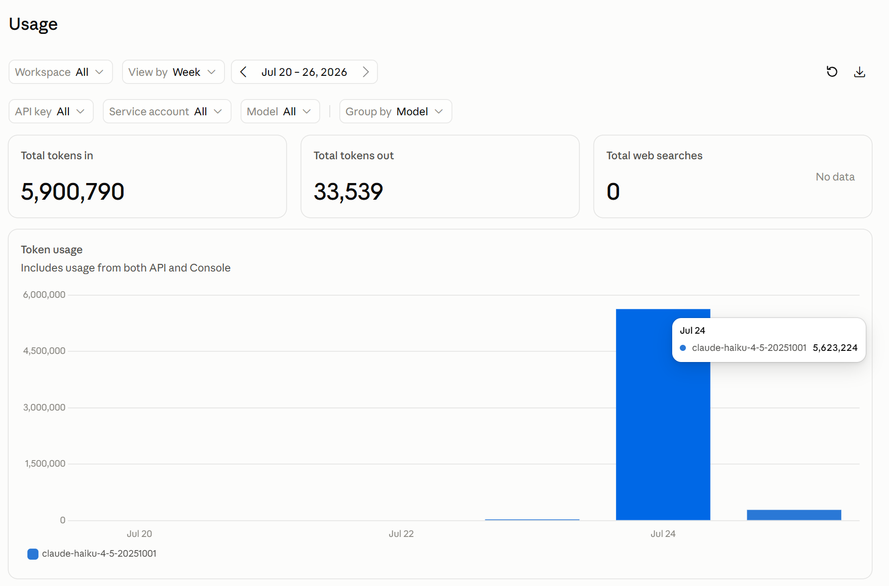

# Week 1 Technical Documentation

## Technical Goal
The goal of week 1 is to build a Baseline Agent to work with tbaMUD in Ruby and Python code.

## Technical Uncertainty
I am not sure if all the steps needed to create this new Baseline Agent are going to work with the Ruby configurations and then porting it to Python to get this new Baseline Agent working in Ruby and Python.  Will this new Agentic Loop work as expected?, like the MUD Manager that we tested in Week 0?

## Technical Hypotheses 
I think we will get an Agentic Agent that will work in Ruby and Python, but I am not convinced that it will do it efficiently and without any issues.  These things never work right the first time, there will be all kinds of refactoring needed to get this thing to work as needed, that is what I think.

## Technical Observerations

### Step 00_config
#### Key Observsations:
- **Ruby:** Never programmed in Ruby before, so getting all the Ruby app code installed was time consuming.  When trying to run the Ruby install command the Gemfile.lock file had to be deleted and a new one created for it to work the first time.

- **Python:** Settng up the Python Virtual Environment was fairly simple for me as I have programmed in Python before, but once again it was time consuming to get all the python apps installed first to get things to work right.

### Step 01_struct_skeleton
#### Key Observsations:
- **Ruby:** Defined the Tool, Message and Context Data Structures in the Ruby code, tested without any issues.

- **Python:** Defined the Tool, Message and Context Data Structures in the Python code, tested without any issues.

### Step 02_the_registry
#### Key Observsations:
- **Ruby:** Implemented the Registry feature in the Ruby code, reviewed how the tools were registered with the registry and how the tool calls were dispatched through the registry.

- **Python:** Implemented the Registry feature in the Python code, reviewed how the tools were registered with the registry and how the tool calls were dispatched through the registry.

### Step 03_prompt_builder
#### Key Observsations:
- **Ruby:** Implemented the Prompt Builder feature in the Ruby code, reviewed how the Prompt Builder delegates formatting to the provider backends. Setup the API key for Claude in the local .env file.

- **Python:** Implemented the Prompt Builder feature in the Python code, reviewed how the Prompt Builder delegates formatting to the provider backends.  Python will use the same API key file as the Ruby code does.

### Step 04_api_client
#### Key Observsations:
- **Ruby:** Ran the API Client example with the Ruby code, received a successful response.

- **Python:** Ran the API Client example with the Python code, received a successful response.

### Step 05_agent_loop
#### Key Observsations:
- **Ruby:** After installing the Agent Loop code in Ruby, you can now see how the client, prompt builder, registry and agent code are all connected.  Tested the agent loop and it ran successfully through multiple iterations.

- **Python:** After installing the Agent Loop code in Python, you can now see how the client, prompt builder, registry and agent code are all connected.  Tested the agent loop and it ran successfully through multiple iterations.

### Step 06_the_logger
#### Key Observsations:
- **Ruby:** After installing the Logger code in Ruby, now with the Visualizer app you can see the logged JSONL session logs.

- **Python:** After installing the Logger code in Python, now with the Visualizer app you can see the logged JSONL session logs.

### Step 07_the_run_dsl
#### Key Observsations:
- **Ruby:** After installing the new Ruby code to configure the new run DSL in the boukensha.run file, the configuration, backend, client, registry, logger and agent information is all within one entry point now.

- **Python:** After installing the new Python code to configure the new run DSL in the boukensha.run file, the configuration, backend, client, registry, logger and agent information is all within one entry point now.

### Step 08_the_repl_loop
#### Key Observsations:
- **Ruby:** After installing the new Ruby code to configure the new REPL Loop, I was able to ask the Agent a few questions and received responses.

- **Python:** After installing the new Python code to configure the new REPL Loop, I was not able to get the Agent to answer questions and receive responses.  I worked with Claude and I guess something went wrong with the code port to Python and it was passing the wrong information with the look command.  Claude fixed this issue and then I could then get responses from the Agent correctly.

### Step 09_global_execution
#### Key Observsations:
- **Ruby:** After uninstalling the previous local Gem for the Ruby code, I ran the build and install commands for the new global executable for the boukensha app.  I tested it and it worked successfully.

### Step 10_standard_tool_library
#### Key Observsations:
- **Ruby:** After installing the new Ruby code to use the standard tool library, I launched the example app and looked at the log visualizer and verified that the agent connects to the MUD and performs the tests.

- **Python:** After completing the Python port of the Ruby code I could not get the Agent to connect to the MUD.  Step 9 seemed to break the Python code from working now. I worked with Claude and it seemed to fix the issue by setting up MCP to work with the MUD and the python code.  

### Step 11_tui
#### Key Observsations:
- **Ruby:** After installing the new Ruby code to use the TUI interface, I had to install all the bubble tea apps so I could build the new boukensha Gem file.  I also had to update the 
.boukensharc file to point to the new 11_tui files to get eh app to work.  I was able to get the new TUI interface to come up and work and I could run tests successfully.

- **Python:** After installing the new Python code to use the TUI interface, I could not get the app to run.  I had to update the .bounkesharc file to use the python path to the 11_tui files to get the app to work.  I was able to get the new TUI interface to come up and work and I could run tests successfully.  It almost looks exactly like the Ruby version on my computer. I had to ask Claude to make sure it was running the correct python version of the TUI interface and not the Ruby version.  I could only tell the difference because in the Python version you can scroll up and down when data goes off the screen, I like that feature.  I also could no longer use the bin files to test the python apps out, I had to just use the boukensha keyword to start and test the app. 

### Step 12_context
#### Key Observsations:
- **Ruby:** After installing the new Ruby code to display the new context information, I had to build and install the new Gem file.  I also had to update the .bounkesharc file to use the ruby path to the 12_context files to get the app to work.  I ran the app and I could see the new context information being displayed in the TUI interface.

- **Python:** After installing the new Python code to display the new context information, I had to update the .bounkesharc file to use the python path to the 12_context files to get the app to work.  I ran the app and I could see the new context information being displayed in the TUI interface.  

I just wanted to try to see if the app could find the bakery, big mistake, it worked with the orignal MUD Manager app pretty quickly I thought.  With the 25 max iteration limit, it could not get to the bakery.  I tried multiple times, like 5 times in a row, and I eventually ran out of API tokens.  I had only purchased $5 worth, but they were gone in like 10 minutes...  I guess the Agent makes alot of calls in 25 turns.  Here is a screen shot of my API token usage that day, over 5 million tokens, I guess, used in that short period of time it looks like:

## Technical Conclusions
The new Baseline Agent does work in both Ruby and Python code, it can tell you what room you are in and what your current score is, but telling it to find something like the bakery, it cannot currently do, it reaches the max iterations and exits. 
Some of the next steps worth noting:
- Need to create some way to map the rooms so finding them is less token intense, maybe use a DB to store info and then reference it for quicker solutions.
- Need to create a way to remember how past journeys went so the Agent can learn from previious journeys and not repeat bad incidents.
- Need to come up with a plan/strategy to progess in the MUD and relay that information to the Agent so there is a plan on how to proceed through the game.

## Key Takeaway
Writing a Baseline Agent in AI is not a simple task.  There are a lot of things to take into consideration when creating an Agentic Loop and once you think you have it working there alwaya seems to be another piece that you need to add to it so it works properly....