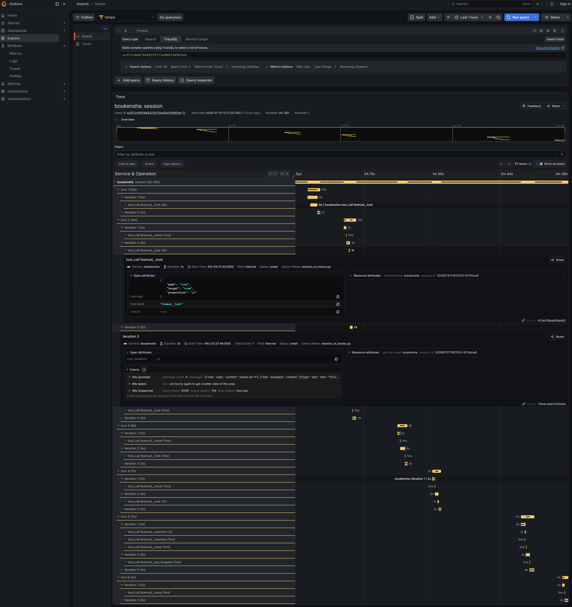
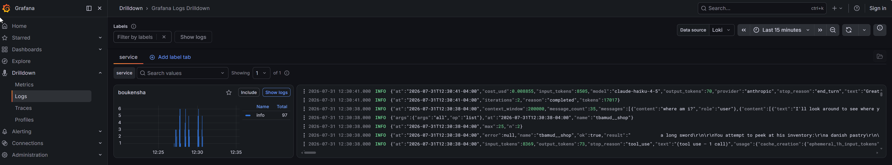
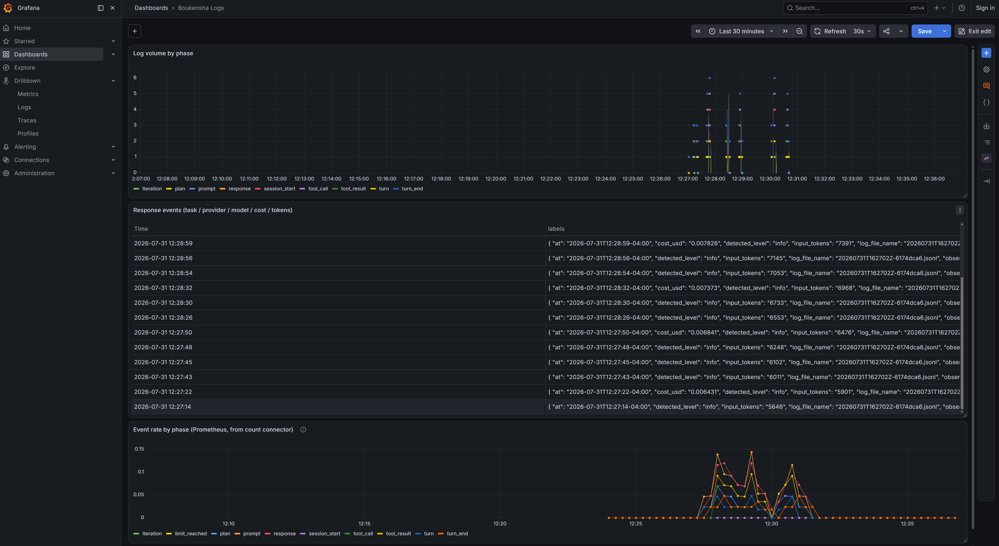
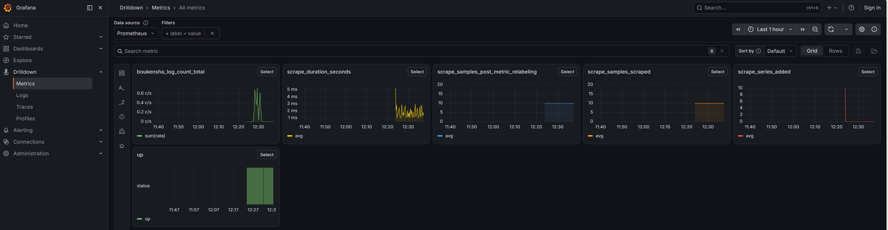
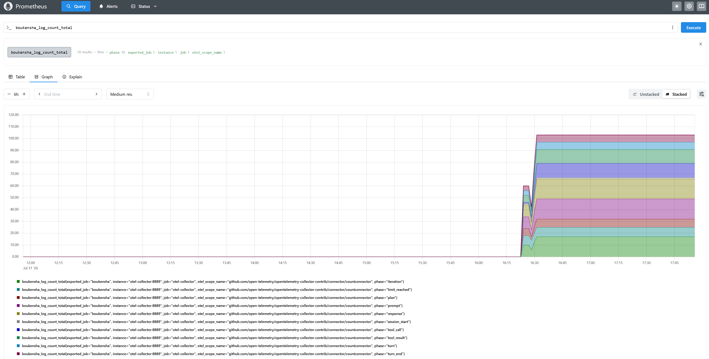

# Week 2 Technical Documentation

## Technical Goal
The technical goal this week is to add more observability into the boukensha app.

## Technical Uncertainty
I am not sure how the OTEL appications will work with the boukensha jsonl log files that are generated. 

## Technical Hypotheses 
I think the OTEL apps will be able to provide some details on what is going on with the boukensha app, but I do not think it will get down to the granularity that we are looking for.

## Technical Observerations
I worked with claude to come up with an OTEL solution for boukensha that used the latest cloud native solutions.  It chose to install a Docker OTEL stack consisting of LOKI, Tempo, Grafana and Prometheus.  I had some issues getting it working but one of the parts of the plan that Claude suggested was not modifying the jsonl session logs but to just input them into the OTEL collector and use the collector DB to display all the data.  This meant that the data was not displayed in realtime.  It tailed the sessions file directory and when a new session file was created it was ingetested into the OTEL collector.  The other issue this process created is that no traces were being created this way.  Claude came up with a script, session_to_traces, that could create traces out of a session file.  This has to be run manually, but it generates a TraceID and ingests all the data into the OTEL collector and that TraceID can be used to display trace data within grafana:

You don't use the Search tab to find it, use direct Trace ID lookup instead:

1. Grafana → Explore
2. Select the Tempo datasource (top-left dropdown)
3. Change the query type to TraceID (not "Search")
4. Paste: ec972c06019443233715a09d154997ed
5. Run query
 
Here is a screen shot of what the trace looks like:

You can drill down for more information in the trace data. but it is still pretty weak.

I could drill down and look a the raw log files using Grafana:

There was a dashboard in Garafana that you could look at to see the session files in summary:

There was a nice Metrics breakdown chart in Grafana:

There was data also going to Prometheus.  I displayed some of that data with a query in the Prometheus app, but it was not very helpfui.  It seemed to list phases by time of day against the time it took to run maybe? No real details were listed on the graph....

So, this was interesting information to learn about, but it was not very usseful. 
I updated my week 2 directory to: week2_observability and all the OTEL code created is stored under an observability direcroty that I created.

## Technical Conclusions
I was correct the OTEL logging did not provide enough detailed logging to really help with troubleshooting. I did not integrate this OTEL logging solution into the existing boueknsha app as in the videos this week it did not appear that this solution was really going to work and I did not want to wind up breaking my application from trying this loggiong soilution out.

## Key Takeaway
The most important lesson from this week that I have learned is that detailed logging is important to being able to troubleshoot issues.  Setting it up and getting it working is not a simple task.