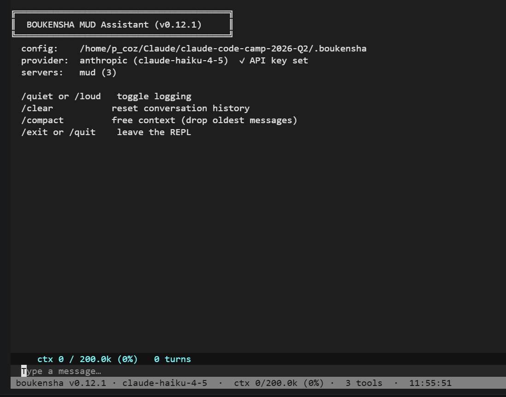
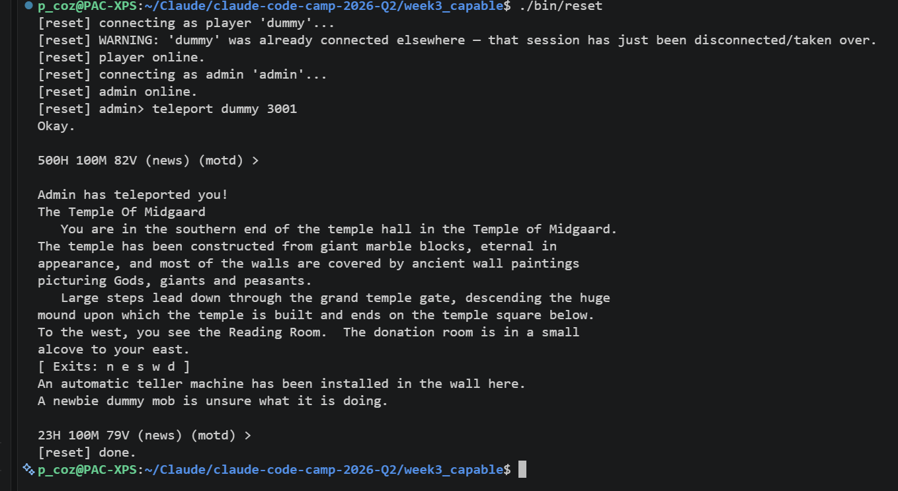
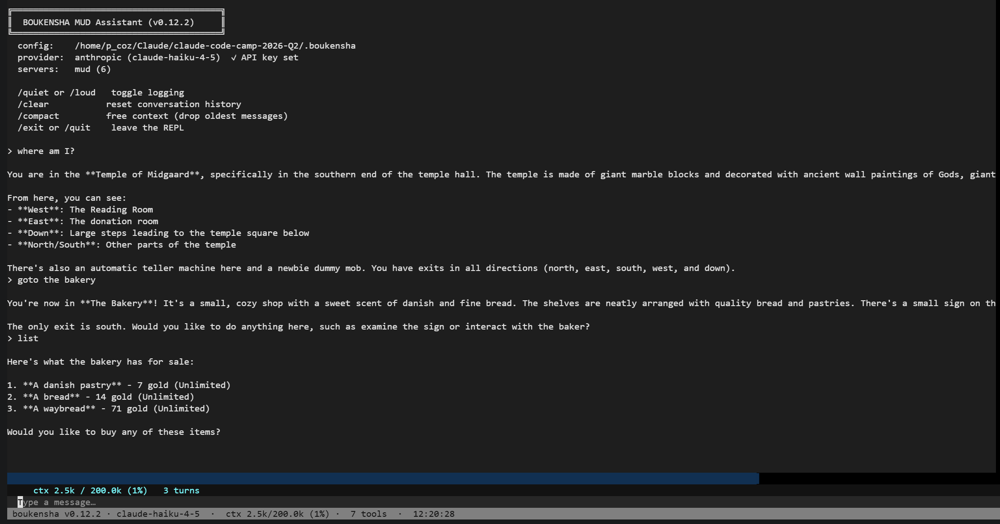

# Week 3 Technical Documentation

## Technical Goal
The technical goal in this week of the bootcamp is to get the Agent to be able to find the bakery in the least amouint of moves.

## Technical Uncertainty
Can we get less token use from the MUD Agent to Claude?  Can we find the Bakery in less steps?

## Technical Hypotheses 
I think with settting up a smaller payload in the API calls to claude by limiting the command payload will use less tokens, creating a BFS linked db of all the rooms that the MUD Agent can find will help make it easier for the Agent to find locations in the MUD and save in token use.

## Technical Observerations
Updated the settings.yaml file to include all the tools that I want Claude to use with a yes/no keyword, this currently now just sends 3 commands, not all 55, in each API call payload now.  This will use less API tokens on each API call now.  You can see this change by the MUD(#) that lists the tools loaded now:

Created a reset script so the player can be reset back to the start room, The Temple of Midgaard.  This is handy for when Claude is manually mapping the MUD and if it gets stuck somewhere it can call the reset script to go back at the start room.  Here is what the reset script will produce on the screen when it runs:

Created a mapping tool to manually crawl and map the Northern Midgaard Zone with a BFS search order.  This creates a python dictionary file that can be loaded into memory so it can find things quickly.  While doing the manual mapping the player keep getting exhausted and could not continue seraching, so Claude found the restore command: via an admin session restore fully refills movement points (83/83). This resolved the issue when the player could not continue on mapping rooms.  The look command also had to be turned on in the settings.yaml file for this mapping to work, so there are only 6 tools loaded now.  The Agent can now find the Bakery quickly, here is a screem shot of the request:

## Technical Conclusions
Reflecting back your education guesses from the technical uncertainty section what was the technical outcomes. Is there any new technical uncertainty that has been put aside for future exploration. Are there any next steps or technical considerations worth noting?

## Key Takeaway
In one sentence. State the most important lesson from the week.