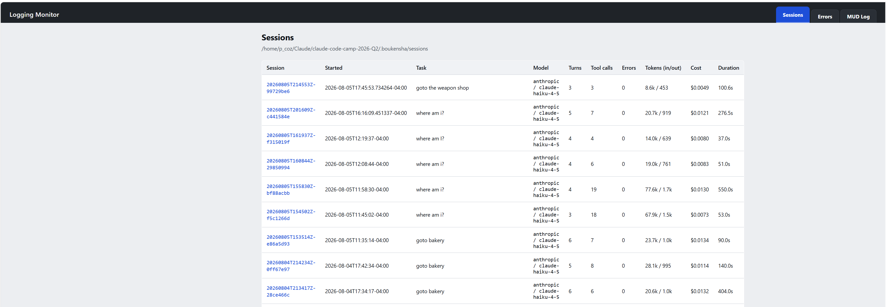
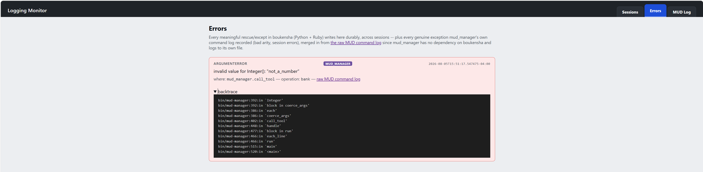
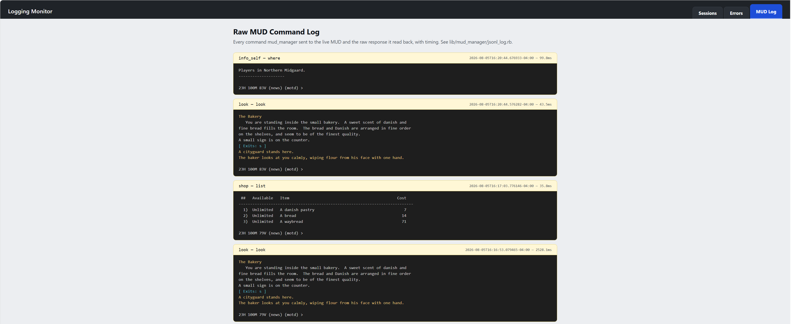
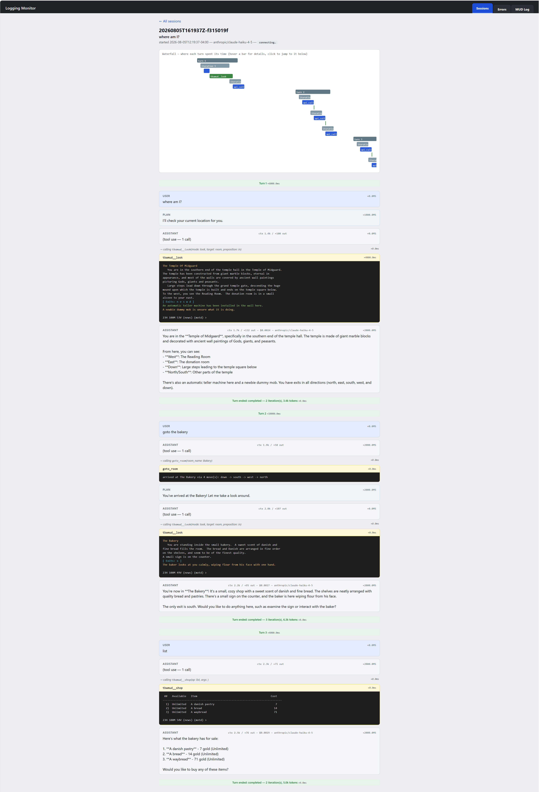
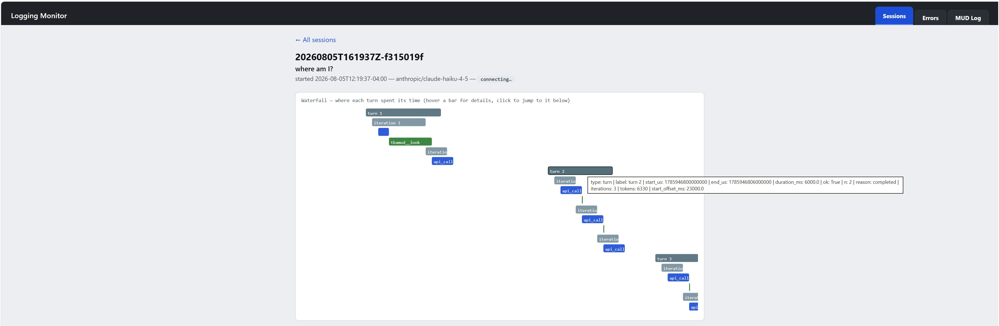

# Week 3 Technical Documentation

## Technical Goal
The technical goal in this week of the bootcamp is to get the Agent to be able to find the bakery in the least amouint of moves and tokens.

## Technical Uncertainty
Can we get less token use from the MUD Agent to Claude?  Can we find the Bakery in less steps?

## Technical Hypotheses 
I think with settting up a smaller payload in the API calls to Claude by limiting the command payload will use less tokens, creating a BFS linked Python dictionary file of all the rooms that the MUD Agent can find will help make it easier for the Agent to find locations in the MUD faster and save in token use.

## Technical Observerations
Updated the settings.yaml file to include all the tools that I want Claude to use with a yes/no keyword, this is setup now with just 3 necessary commands, not all 55, in each API call payload now.  This will use less API tokens on each API call now.  You can see this change by the MUD(#) that lists the tools loaded now:

Created a reset script so the player can be reset back to the start room, The Temple of Midgaard.  This is handy for when Claude is manually mapping the MUD and if it gets stuck somewhere it can call the reset script to go back at the start room.  Here is what the reset script will produce on the screen when it runs:

Created a mapping tool to manually crawl and map the Northern Midgaard Zone with a BFS search order.  This creates a python dictionary file that can be loaded into memory so it can find things quickly.  While doing the mannual mapping the player keep getting exhausted and could not continue seraching, Claude found the restore command: via an admin session restore fully refills movement points (83/83). This resolved the issue when the player could not continue on mapping rooms.  The look and list commands also had to be turned on in the settings.yaml file for things to work, so there are only 6 tools loaded now.  The Agent can now find the Bakery quickly, here is a screen shot of this request now:

Created a new realtime logging monitor app in Python using flask to mimic the Ruby log_viz app.  It has three tabs on the main page the sessions tab that lista all the session jsonl files:

an errors tab, that lists errors and backtrace info:

and a MUD log tab that lists all the mud_manager commands sent and the raw response to the MUD commands:

when you click on a session file you get all the details and a waterfall diagrsm showing any of the session details:

you can also hover over a line in the waterfall diagram and it will display details like this:

if you click on a waterfall line it will move you down lower in the displayed session file to the exact location where that line detail is displayed in the session log.

Created a map diagram of how all the rooms are laid out and connected in the Northern Midgaard Zone:

Here is a link to pdf version of this map file image that can be zoomed in on for more detail:

[pdf map file](<Northern Midgaard Room Full Map.pdf>)

It created an index list of all the rooms also:

## Technical Conclusions
Learning more about the API calls and limiting the amount of tools listed in the API payload raally did use a lot less tokens than previously.  Creating a Python dictionary file with all the rooms and how to reach them by crawling through the whole Northern Midgaard Zone really speed up the time it took to get to a room and this improvement really saved on token use also.  

How to run the python boukensha app:

C:~/Claude$  source /home/Claude/claude-code-camp-2026-Q2/.venv/bin/activate
(.venv) C:~/Claude$ cd claude-code-camp-2026-Q2/
(.venv) C:~/Claude/claude-code-camp-2026-Q2$ boukensha

.boukensharc file:

boukensha_path: /Claude/claude-code-camp-2026-Q2/week3_capable/python/map_zone
boukensha_dir: /Claude/claude-code-camp-2026-Q2/.boukensha

How to run the logging monitor app:

(.venv) C:~/Claude/claude-code-camp-2026-Q2/week3_capable/python/logging_monitor$ ./bin/logging_monitor

Connect on http://localhost:4568

## Key Takeaway
Know how an API call works before you use it, how much data goes into the payload when communicating with an LLM so you will know what kind of costs will be required for each API call.